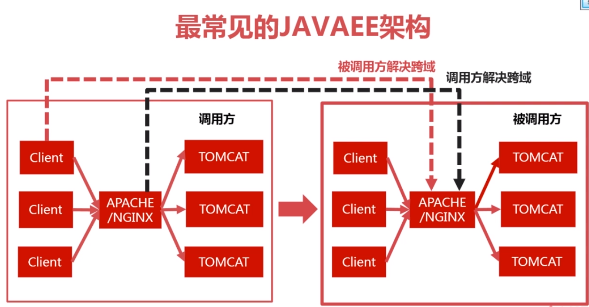

#Ajax跨域问题
## 为什么会发生跨域问题？（跨域的原因）
1. 浏览器限制。浏览器出于安全的考虑，当它发现你的请求是跨域的时候，它会对请求做一些校验，校验不通过则报跨域安全问题；（此处，前端向后台的请求处理是成功的，后台正常打印数据，前端 console 也正常打印数据，但浏览器在处理时拒绝了展示）前台可以正常访问后台，浏览器多管闲事报跨域问题，但其实前台已经访问到后台了。
2. 跨域（协议，域名，端口任何一个不一样，浏览器都认为是跨域）在交互过程中，前台向后端发起请求，前台的ip、端口与后台的ip、端口存在任何一个不同的情况都会被认为是跨域；
3. XHR(XMLHttpRequest)请求，因为ajax是XHR请求，浏览器就会捕捉跨域问题。如果你发送的请求不是XHR的请求，就算是跨域了，浏览器也不会报错！只要不是XHR请求，浏览器是不会校验的.
上面三条同时满足，才有可能产生跨域安全问题。

## 如何解决跨域问题？
1. 让浏览器不做限制，就不会有跨域安全问题。可以为浏览器指定参数，让浏览器不做校验，就能避免。但是该方法不太合理，它需要每个人（客户端）都去做改动！
2. 发送请求时，避免发送XHR请求，这样就算是跨域，浏览器也不会报错。解决方案可以使用JSONP，它通过动态创建一个script,通过script发出请求。
3. 从跨域的角度，有两种解决思路（支持跨域 和 隐藏跨域）：一种是被调用方修改代码，加上字段，告诉浏览器，支持跨域，支持调用方调用（支持跨域）。第二种是调用方使用代理，在a域名里面的请求地址使用代理指定到b域名，在浏览器看上去就是同一个域名，就避免了跨域问题。


## 解决跨域问题
1. 禁止浏览器检查跨域问题，以Chrome为例，在浏览器的安装目录启动终端，输入禁止浏览器做跨域检查的校验参数，新启一个浏览器。            
   命令参数：chrome --disable-web-security --user-data-dir=g:\temp3                 
   然后在新起的浏览器中进行访问。       
   修改浏览器的设置后，没有再出现跨域问题，由此可以认为，跨域问题主要还是在浏览器发生的校验失败等问题导致的，与后台没有任何关系      
2. 使用JSONP避免跨域问题
   #####什么是JSONP?
   * Jsonp(JSON with Padding) 是 json 的一种"使用模式"，可以让网页从别的域名（网站）那获取资料，即跨域读取数据。
   * jsonp是一种非正式传输协议，是前后台约定的协议，而不是官方协议。
   
   * 为什么我们从不同的域（网站）访问数据需要一个特殊的技术( JSONP )呢？这是因为同源策略。
   
   * 同源策略，它是由 Netscape 提出的一个著名的安全策略，现在所有支持 JavaScript 的浏览器都会使用这个策略。
   
   ##### jsonp解决跨域问题的原理（区别）：
   
   ①普通请求，发送请求时，请求类型默认为 xhr  ；jsonp的请求类型为 script ，不会被浏览器认为是跨域异常；
   
   ②普通请求返回的数据类型默认为 json 对象；而 jsonp 的请求返回的数据类型为 javascript 的脚本；
   
   ③普通请求的地址后面没有携带任何数据；而jsonp请求的地址后面携带了callback为键的一组键值对数据，它返回的是js代码，js函数调用，数据是以参数的形式返回的。从这里可以看出，JSONP的实现原理是在请求发出之后，会加一个callback参数，当后台发现有callback参数就知道这是一个JSONP请求，就会把返回的数据由JSON变成JavaScript,而JavaScript的内容就是一个函数调用，函数名是“callback”参数的值，而原来需要返回的json对象数据在这里作为参数传递返回。
   
   当前端被设置为jsonp格式后，在后端中使用切面实现 jsonp 的格式化接口；该接口声明当返回的数据有callback这个值时，将返回的数据以jsonp的格式返回给前端，避免出现数据类型不一致的问题。
   
   jsonp里传输的就是json的数据格式，只是在发送请求时多加一个参数，其值为回调函数。后台程序在获得该回调函数后，把准备好的json数据返回。
   
   前端代码：
   ```aidl
       $.ajax({
           url:....,
           dataType:"jsonp",//主要就是dataType是jsonp类型
           ......
         });
       setTimeout(function){
           expect(result).toEqual({
               "data":"get1 ok"
           });
       }
   ```
   后台代码：
   例如java语言，需继承AbstractJsonpResponseBodyAdvice类，重写构造函数并传参数“callback”,super("callback");
   ```aidl
   @ControllerAdvice
   public class JsonpAdvice extends AbstractJsonpResponseBodyAdvice {
      
      public JsonpAdvice() {
          // TODO Auto-generated constructor stub
          super("callback2");  //约定返回callback2
      }
      
   }
   ```
   
   如图：在发送ajax请求的时候，        
   设置dataType为jsonp，即告诉后台我需要返回的是script代码，而不是一个json格式的数据。             
   jsonp设置为callback2，这个就是前后台的协议，即后台返回的script的方法的名称，然后后台将原本的json放在该方法的参数中返回给前端。
                        
   在发送jsonp请求的时候，会带一个_线的参数，这是请求的唯一标识，那浏览器就不会缓存该请求，设置cache:true就可以告诉浏览器该请求是可以被缓存的。    
   
   
   JSONP的弊端：        
   1. 服务器需要改动代码支持-如果调用的接口不是我们自己的，那么改动就很麻烦
   2. 只支持GET方法，JSONP是通过动态创建一个script发送请求的，而script只支持GET方法
   3. 发送的不是XHR请求，XHR有许多新的特性，如异步、各种事件等，JSONP则没有

## 从服务端解决跨域问题：     
   
   
   跨域解决方案：
   1. 被调用方解决：在响应头增加指定字段，告诉浏览器允许调用。这种解决方案的请求是直接从浏览器发送的（支持跨域）修改被调用方的Http服务器。     
   2. 调用方解决：这是隐藏跨域的解决法案。这种跨域请求不是直接从浏览器发送的，而是从中间的http服务器转发过去的（隐藏跨域）修改调用方的Http服务器。    

   被调用方解决跨域的方式：
   1. 服务器端实现：设置请求过滤器
      * res.addHeader("Access-Control-Allow-Origin", "*");  //允许所有的域跨域           
      * res.addHeader("Access-Control-Allow-Methods", "*");  //允许所有的方法跨域                  
   2. Nginx配置
   3. Apache配置
   被调用方修改Apache或者Nginx静态服务器，通过静态服务器隐藏调用请求返回给前台，前台以为是同一个地址和端口的请求就解决了跨域问题。     


## 被调用方解决跨域问题
### 简单请求和非简单请求
1. 简单请求是先请求，浏览器再判断是否是跨域；而非简单请求要先发送一个预检命令，检查通过之后才会真正的把跨域请求发出去。
2. 非简单请求常见的是发送json格式的请求，contentType为"application/json;charset=utf-8" 
   当浏览器要发送跨域请求时，如果请求是复杂请求，浏览器会先发送一个options预检命令即一个options请求，当该请求通过时才会再发送真正的请求。即将会发送两次请求。
   最后的结果如下，返回了两个请求，一个是OPTIONS,另一个是POST请求，其中的OPTIONS就是一个预检命令，成功了之后才会发送后面的跨域请求    
   
   该option请求会根据请求的信息去询问服务端支不支持该请求。比如发送的数据是json类型（通过content-type设置）的话，会携带一个请求头Access-Control-Request-Headers: content-type去询问支不支持该数据类型，如果支持，则请求就会通过，并发送真正的请求。                 
   * res.addHeader("Access-Control-Allow-Headers", "Content-Type");            
3. 工作中比较常见的简单请求方式有：GET,HEAD,POST
   请求header中，Content-Type有以下几种值：
   * text/plain
   * multipart/form-data
   * application/x-www-form-urlencoded
4. 工作中比较常见的非简单请求方式有：
   * PUT 
   * delete方法的ajax请求
   * 发送json格式的ajax请求
   * 带自定义头的ajax请求
5. 非简单请求的预检命令缓存：    
   我们知道非简单请求, 每次会发出两次请求, 这会影响性能. HTTP协议增加了个响应头, 可以让我们在服务端设置`Access-Control-Max-Age`来缓存预检请求, 比如说我们可以设置为3600m, 也就是一小时客户端只会在第一次的时候发送两个请求, 接下来一个小时内`OPTIONS`请求就被缓存起来了.
   * res.addHeader("Access-Control-Max-Age","3600");  //预检命令缓存，3600秒,告诉浏览器1个小时之内不要清除这段缓存信息。            
6. 浏览器是先执行请求还是先判断跨域？      
   浏览器请求-->判断响应中是否有允许跨域-->发现不允许跨域,阻止跨域          
   说明：当执行跨域请求时，浏览器会提示当前接口不被允许，这说明浏览器已发出了当前请求，但是它的的响应内容被拦截；如果在Response header中的Access-Control-Allow-Origin设置的允许访问源不包含当前源，则拒绝数据返回给当前源。


### Filter解决方案（服务器端实现）
####带cookie的跨域
1. http会话session依赖于cookie, sessionid存放在cookie中。
2. ajax请求带cookie，示例代码：
    ```aidl
    $.ajax({
        type : "get",
        url: base + "/getCookie",
        xhrFields:{
            withCredentials:true   //ajax请求时会带上cookie
        },
        success: function(json){
            result = json;
        }
    });
    ```

3. cookie是加在被调用方。服务端就是被调用方，而客户端就是调用方。在浏览器的控制台中通过document.cookie=""  来设置cookie。                    
   
4. 带cookie的跨域（发送的cookie只能是被调用方的cookie，而不是调用方的cookie）          
   前面设置响应头Access-Control-Allow-Origin: *，可以解决跨域，但是在带cookie的跨域请求中就不能使用了，浏览器会报错                         
   
5. 读cookie只能读到本域的,不可能读到跨域的cookie.             
6. 带cookie进行跨域时，后台代码注意以下2点：                  
   带cookie的时候，Access-Control-Allow-Origin，必须是全匹配，如http://localhost:8081， 不能是 *，否则报错。
    - res.addHeader("Access-Control-Allow-Origin", "http://localhost:8081");                      
   
   带cookie进行跨域时，需要设置以下请求头：
    - res.addHeader("Access-Control-Allow-Credentials", "true")
7. 当产生跨域的时候，请求头中会多一个字段，叫做origin，这个字段有当前域的信息。所以在发送带cookie的请求，后台又不知道调用方的域的信息时，可以先取到请求头中origin字段的值再赋值给响应头的access-control-allow-origin字段中。
   支持带cookie的所有域的跨域请求，代码如下：
    ```aidl
    @Override
    public void doFilter(ServletRequest request, ServletResponse response, FilterChain chain) throws IOException, ServletException {
    
        HttpServletResponse res = (HttpServletResponse) response;
    
        HttpServletResponse res = (HttpServletResponse) response;
    
        String origin = req.getHeader("Origin");
    
         if(!StringUtils.isEmpty(origin)){
            //带cookie的时候，origin必须是全匹配，不能使用*
            res.addHeader("Access-Control-Allow-Origin", origin);   //允许跨域
        }
    
        res.addHeader("Access-Control-Allow-Credentials", "true");  //带cookie时需要设置该值
        res.addHeader("Access-Control-Allow-Methods", "*");  //允许所有的方法跨域
        res.addHeader("Access-Control-Allow-Headers", "Content-Type");
        res.addHeader("Access-Control-Max-Age","3600");  //预检命令缓存，3600秒,告诉浏览器1个小时之内不要清除这段缓存信息。
    
        chain.doFilter(request, response);
    }
    ```

#### 带自定义头的跨域
1. ajax示例代码：
```aidl
$.ajax({
    type : "get",
    url: base + "/getHeader",
    headers:{  //方式一
        "x-header1" : "AAA"
    },
    beforeSend: function(xhr){  //方式二
        xhr.setRequestHeader("x-header2","BBB")
    },
    success: function(json){
        result = json;
    }
});
```

2. 请求之后，请求头信息如图
   
3. 再次请求之后，浏览器会报错，如下：
   
   解决办法：res.addHeader("Access-Control-Allow-Headers", "Content-Type,x-header1,x-header2");
4. 支持所有跨域，示例代码：
```aidl
@Override
public void doFilter(ServletRequest request, ServletResponse response, FilterChain chain) throws IOException, ServletException {

    HttpServletRequest req = (HttpServletRequest) request;

    HttpServletResponse res = (HttpServletResponse) response;

    String origin = req.getHeader("Origin");

    //res.addHeader("Access-Control-Allow-Origin", "*");  //允许所有的域跨域
    //res.addHeader("Access-Control-Allow-Methods", "*");  //允许所有的方法跨域

    if(!StringUtils.isEmpty(origin)){
        //带cookie的时候，origin必须是全匹配，不能使用*
        res.addHeader("Access-Control-Allow-Origin", origin);   //允许跨域
    }

    res.addHeader("Access-Control-Allow-Methods", "*");  //允许跨域的方法

    String headers = req.getHeader("Access-Control-Request-Headers");

    //支持所有自定义头
    if(!StringUtils.isEmpty(headers)){
        res.addHeader("Access-Control-Allow-Headers", headers);
    }

    res.addHeader("Access-Control-Max-Age", "3600");

    //enable cookie
    res.addHeader("Access-Control-Allow-Credentials", "true");

    chain.doFilter(request, response);
}
```

### Nginx解决方案                        
Nginx配置解决跨域问题，配置如图：

   
### Spring解决方案   
   Spring解决跨域问题，只需要一个注解： @CrossOrigin  注解即可实现，该注解可以在 Controller 上，也可以在方法上。
   
## 调用方解决跨域（隐藏跨域）
### Nginx反向代理   


### Apache反向代理                    
                   
   

#### 支持跨域与隐藏跨域的区别：
* 支持跨域：调用的url地址都是绝对地址
* 隐藏跨域：调用的url都是本域的，是相对地址，


